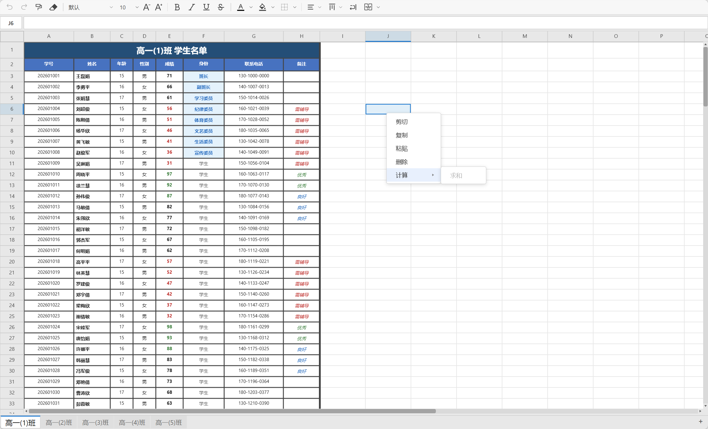

# 小刀电子表格 (Xiaodao Spreader)

**中文** | [English](./README.md) | [演示](https://spreader.xdz.me)

[](https://www.npmjs.com/package/xiaodao-spreader)
[](LICENSE)
[](https://vuejs.org/)
[](https://www.typescriptlang.org/)
[](https://vitejs.dev/)

基于 Canvas 的高性能 Vue 3 电子表格组件，在网页中提供类 Excel 的编辑体验。



---

## 功能特性

### 核心电子表格

- **动态表格扩展** — Excel 风格动态行列扩展；默认 26 列（A-Z）× 200 行，当滚动接近边界、在边缘输入数据、粘贴超出当前范围、或插入行列会将数据挤出边界时，自动扩展行列数
- **Canvas 2D 渲染** — 高 DPI 自适应（DPR 缩放），虚拟视口渲染，支持动态大小的工作表
- **多 Sheet 工作簿** — 标签栏支持新建、重命名、复制、删除、拖拽排序
- **公式引擎** — 支持 `=SUM()`、`=AVERAGE()`、`=COUNT()`、`=IF()`、`=VLOOKUP()`、`=CONCATENATE()`，支持依赖追踪与循环引用检测；工具栏与右键菜单提供一键求和/平均值/计数
- **合并单元格** — 合并居中、跨列合并、取消合并；合并区域边框按锚点存储、公共边渲染时统一解析
- **冻结窗格** — 固定顶部行/左侧列，使其在主体滚动时保持可见。工具栏「冻结窗格」下拉提供「冻结窗格」（以当前选区/活动单元格左上角为冻结点，等同 Excel 的 Freeze Panes）、「冻结首行」、「冻结首列」以及「取消冻结」（仅在已冻结时显示，替换「冻结窗格」项）。冻结状态为按工作表的视图状态（`freeze: { rows, cols }`），通过 v-model 持久化；跨冻结线的合并单元格也能正确处理——仅冻结部分固定，非冻结部分随滚动移出
- **丰富单元格格式** — 字体、字号（5–72）、加粗、斜体、下划线、删除线、文字颜色、填充颜色、水平/垂直对齐、自动换行
- **边框** — 上/下/左/右/外边框/全部/无，5 种预设样式及自定义颜色；独立边框池存储、公共边渲染时统一解析
- **撤销 / 重做** — 单元格、列宽、行高的完整状态快照（50 步）
- **格式刷** — 复制并应用单元格格式到任意区域
- **数字格式** — Excel 风格数字格式（常规 / 文本 / 数值 / 货币 / 会计 / 百分比 / 科学计数 / 日期 / 时间 / 日期时间 / 持续时间），提供自定义格式对话框；仅影响显示，绝不修改底层单元格值
- **智能数据识别** — 输入 `100%`、`1,234`、`¥1,234.56` 等带符号数字文本时自动识别为数值并套用对应格式；常见日期时间文本自动识别为日期，与 Excel 输入语义一致
- **排序与排序提醒** — 工具栏与右键菜单按单元格**展示内容**对所有类型（数值 / 日期 / 文本）排序；排序只移动数据、不搬运样式；含合并单元格或公式的区域自动禁用排序；当选区外存在相邻数据时，弹出类 Excel 的「排序提醒」对话框，可选择「扩展选定区域」或「仅对选定区域排序」
- **查找与替换** — 工具栏查找按钮或 `Ctrl/Cmd+F`（含 `Ctrl/Cmd+H`）打开；支持「当前工作表 / 整个工作簿 / 当前选区」三种范围，区分大小写、匹配整个单元格；高亮全部匹配并定位当前项、循环查找；单次与全部替换均接入撤销/重做，仅修改单元格原始 `value`（始终保持字符串），不改动格式 / 边框 / 合并
- **自动填充（填充柄）** — 类 Excel 的活动选区右下角填充柄，按住向上/下/左/右拖拽即可填充单元格：单值复制、数字/日期/文本数字自动续序列（如 `1,2 → 3,4,5`）、公式引用按相对/绝对/混合规则平移（如 `=A1*2 → =A2*2`）、源 `styleId` 经样式池复用。拖拽期间实时预览、边缘自动滚动、动态扩展工作表、冻结窗格兼容、单次拖拽仅产生一个撤销步骤——*见 [自动填充](#自动填充)*

### 交互体验

- **智能选区** — 点击、拖拽、Shift+点击、行/列标题选择、全选按钮
- **双击编辑** — 行内编辑器，使用 `<textarea>` 支持多行输入
- **编辑栏** — 专用编辑栏，带单元格地址标签及实时公式显示
- **完整键盘导航** — 方向键、Tab、Enter、Home、End、Ctrl+Home、Ctrl+End
- **上下文菜单** — 智能识别当前区域（单元格、行、列、Sheet 标签），支持多级子菜单
- **行/列操作** — 右键菜单插入、删除、剪切、复制、粘贴
- **列宽/行高** — 拖拽调整，实时预览，双击自动适配
- **触摸支持** — 滑动滚动，双击进入编辑模式
- **响应式** — ResizeObserver 监听容器尺寸变化

### 视觉体验

- **明/暗双主题** — 完整的调色板，50+ CSS 自定义属性
- **国际化** — 内置中文（zh-CN）与英文（en-US）
- **溢出工具栏** — 响应式工具栏，自动将溢出按钮折叠到下拉菜单
- **自定义滚动条** — 仿原生滚动条，带箭头按钮及可拖拽滑块

---

## 安装

```bash
# pnpm（推荐）
pnpm add xiaodao-spreader

# npm
npm install xiaodao-spreader

# yarn
yarn add xiaodao-spreader
```

### Peer 依赖

- `vue` ^3.4.0

---

## 快速开始

```bash
# 克隆仓库
git clone https://github.com/xiaodaozhi/xiaodao-spreader.git
cd xiaodao-spreader

# 安装依赖
pnpm install

# 启动开发服务器
pnpm dev
```

访问 `http://localhost:5173` 查看演示应用。

---

## 基础用法

```vue
<template>
  <Spreader
    v-model:data="myData"
    :row-count="100"
    :col-count="12"
    theme="light"
    locale="zh-CN"
  />
</template>

<script setup lang="ts">
import { ref } from 'vue';
import Spreader from 'xiaodao-spreader';
import type { SheetModelData } from 'xiaodao-spreader';

const myData = ref<SheetModelData[]>([
  {
    name: 'Sheet1',
    styles: [{}, { fontSize: 14, fontWeight: 'bold' }],
    cells: {
      '0,0': { value: '姓名' },
      '0,1': { value: '年龄' },
      '1,0': { value: '张三', styleId: 1 },
      '1,1': { value: '28' },
    },
    colWidths: { 0: 120, 1: 80 },
  },
]);
</script>
```

---

## Props 属性

| 属性 | 类型 | 默认值 | 说明 |
|------|------|--------|------|
| `data` (v-model) | `SheetModelData[]` | `[]` | 多 Sheet 数据（双向绑定） |
| `rowCount` | `number` | `200` | 每个 Sheet 的初始行数（可动态扩展） |
| `colCount` | `number` | `26` | 每个 Sheet 的初始列数（可动态扩展） |
| `width` | `number \| string` | — | 组件宽度（像素；传 `string` 或省略则自适应） |
| `height` | `number \| string` | — | 组件高度（像素；传 `string` 或省略则自适应） |
| `theme` | `'light' \| 'dark'` | `'light'` | 主题模式 |
| `locale` | `string` | `'zh-CN'` | 语言 — `'zh-CN'` \| `'en-US'` |

---

## 数据模型

### `SheetModelData`

用于 v-model 双向绑定的外部数据格式：

```typescript
interface SheetModelData {
  name: string;
  styles?: CellStyle[];
  borders?: BorderStyle[];
  cells: Record<string, {
    value: string;
    styleId?: number;
  }>;
  merges?: Record<string, SelectionRange>;
  freeze?: { rows: number; cols: number };
  colWidths?: Record<number, number>;
  rowHeights?: Record<number, number>;
  /** 逻辑列数（0 基，不含）。省略时默认为 26。 */
  colCount?: number;
  /** 逻辑行数（0 基，不含）。省略时默认为 200。 */
  rowCount?: number;
}
```

- **`styles`**：样式池 —— `styles[0]` 始终为默认空样式 `{}`。单元格通过下标（`styleId`）引用样式。
- **`borders`**：边框池 —— `borders[0]` 始终为默认空边框 `{}`。样式通过下标（`borderId`）引用边框；省略时由旧版内联边框属性自动迁移。
- **`cells`**：键为 `"列,行"` 格式（如 `"0,0"` 代表 A1 单元格）。`styleId` 引用 `styles` 数组；`styleId=0` 或省略表示默认样式。
- **`merges`**：合并单元格定义，以合并锚点单元格为键。
- **`freeze`**：冻结窗格的视图状态 —— `{ rows, cols }` 冻结顶部 `rows` 行与左侧 `cols` 列；`{ rows: 0, cols: 0 }` 表示无冻结。按工作表持久化，切换工作表时恢复。
- **`colWidths` / `rowHeights`**：稀疏映射 — 仅存储非默认值。

### 类型导出

```typescript
import type {
  CellCoord,       // { col: number; row: number }
  SelectionRange,  // { startCol; startRow; endCol; endRow }
  CellData,        // { value: string; styleId?: number }
  CellStyle,       // 类型化样式接口（字体、颜色、边框、对齐等）
  BorderStyle,     // 四边边框组合 { top; right; bottom; left }
  BorderSide,      // 单边边框 { width; color; style }
  BorderSource,    // 边框来源 'cell' | 'merge'
  Range,           // { start: number; end: number }
  SpreadsheetOptions,
  SpreadsheetData,
  SheetModelData,  // ← 主要数据接口
  SheetState,      // 内部运行时状态
  UndoSnapshot,
  ContextMenuItem,
  ThemeColors,
  Point,
} from 'xiaodao-spreader';

// 运行时工具函数
import { StylePool, resolveStyle, migrateCells, cloneCells } from 'xiaodao-spreader';
```

---

## 架构设计

```
src/
├── index.ts                          # 库入口 — 从 spreader/ 统一 re-export
├── App.vue                           # 演示应用
└── components/
    └── spreader/
        ├── index.ts                  # 统一导出口 — 组件 + 类型（barrel）
        ├── components/
        │   ├── spreader.vue          # 入口组件 — 模板 + 样式 + 组合
        │   ├── toolbar.vue           # 工具栏（含溢出下拉）
        │   ├── tabbar.vue            # Sheet 标签栏
        │   ├── dropdown.vue          # 通用下拉组件
        │   ├── find-replace-bar.vue  # 查找替换栏 UI
        │   └── pickers/
        │       ├── colorPicker.vue       # 文字 / 填充颜色选择器
        │       ├── borderPicker.vue      # 边框选择器
        │       ├── mergePicker.vue       # 合并单元格选择器
        │       ├── numberFormatDialog.vue # 数字格式自定义对话框
        │       ├── sortPicker.vue        # 排序下拉
        │       ├── sortConfirmDialog.vue # Excel 风格排序提醒对话框
        │       ├── calcPicker.vue        # 求和 / 平均值 / 计数选择器
        │       └── insertFunctionDialog.vue # 插入函数对话框
        ├── composables/
        │   ├── core-state.ts        # Props、cells/merges/selection、字体度量、导航
        │   ├── undo-styles.ts       # 撤销重做、格式刷、字体/对齐/颜色
        │   ├── borders-merge.ts     # 边框操作、合并操作、剪贴板、求和
        │   ├── sheets-ops.ts        # 行列增删、多 Sheet、v-model 发射、主题、refs
        │   ├── find-replace.ts      # 查找替换状态与交互（依赖 Vue）
        │   └── interactions.ts      # 渲染器、编辑栏、标签栏、右键菜单、滚动条、事件
        └── core/
            ├── constants.ts         # 布局常量、国际化、主题调色板
            ├── types.ts             # 全部类型定义
            ├── style-pool.ts        # 样式池：去重、注册、解析、迁移、GC
            ├── border-pool.ts       # 边框池：去重、注册、解析、迁移、GC
            ├── border-resolve.ts    # 公共边冲突解析（resolveSharedBorder）
            ├── formula.ts           # 公式引擎（解析、计算、依赖、缓存）
            ├── find-replace-core.ts # 查找替换纯算法（零 Vue 依赖，可单测）
            ├── sort-core.ts         # 排序纯算法（零 Vue 依赖，可单测）
            ├── autofill.ts          # 自动填充纯引擎（模式推断、填充柄逻辑，零 Vue 依赖）
            ├── number-format.ts     # 数字格式引擎（Excel 风格显示格式化）
            ├── theme.ts             # 主题 CSS 变量构建
            └── utils.ts             # 纯工具函数（列标签、命中测试、尺寸解析）
```

### 设计原则

- **稀疏数据模型**：仅存储有实际数据的单元格；扩展逻辑范围不会创建空单元格
- **动态范围**：每个 Sheet 维护响应式逻辑范围（`colCount`/`rowCount`），从 `colCount`/`rowCount` prop（默认 26/200）起步，通过 `ensureCapacity(minCol, minRow)`按需增长。扩展使用缓冲步长（8 列 / 32 行）以减少频繁调整开销
- **组合式 API**：所有业务逻辑抽取到 `composables/`，保持单一职责
- **Barrel 导出**：`spreader/index.ts` 集中导出组件和全部类型，`src/index.ts` 再统一 re-export，外部统一从 `xiaodao-spreader` 引入
- **Canvas 2D 渲染**：仅绘制可视区域（虚拟渲染），大表流畅
- **无脏标记**：在交互结束点手动调用 `scheduleRender()`；`requestAnimationFrame` 自动合并同一帧的多次调用
- **样式池**：每个 Sheet 维护 `styles: CellStyle[]` 数组，单元格通过 `styleId`（数组下标）引用样式。相同样式自动去重。运行时通过 `resolveStyle()` / `registerStyle()` 解析样式；GC（`compactStyles`）仅在保存/导出时执行
- **边框池**：边框独立于普通样式，存入每 Sheet 的 `borders: BorderStyle[]` 池，样式通过 `borderId`（数组下标）引用。相邻公共边在渲染时经 `resolveSharedBorder()` 统一解析，设置边框不再同步修改相邻单元格
- **共享状态**：将 `CoreState` 注入每个 composable，实现跨模块通信而不产生紧耦合
- **Reactive 包装**：composable 返回值通过 `reactive()` 包装，模板中自动解包 ref/computed

---

## 键盘快捷键

### 导航

| 按键 | 功能 |
|------|------|
| `↑` `↓` `←` `→` | 移动活动单元格 |
| `Tab` / `Shift+Tab` | 向右 / 向左移动 |
| `Enter` / `Shift+Enter` | 向下 / 向上移动 |
| `Home` / `End` | 跳到首列 / 末列 |
| `Ctrl+Home` / `Ctrl+End` | 跳到 A1 / 右下角 |
| `PageUp` / `PageDown` | 向上 / 向下翻页 |

### 编辑

| 按键 | 功能 |
|------|------|
| `F2` / `双击` / `直接输入` | 进入编辑模式 |
| `Enter`（编辑中） | 提交并向下移动 |
| `Tab`（编辑中） | 提交并向右移动 |
| `Escape`（编辑中） | 取消编辑 |
| `Ctrl+Enter` | 多行单元格内换行 |
| `Delete` / `Backspace` | 清除选区内容 |

### 剪贴板与历史

| 按键 | 功能 |
|------|------|
| `Ctrl+C` / `Ctrl+X` / `Ctrl+V` | 复制 / 剪切 / 粘贴 |
| `Ctrl+Z` / `Ctrl+Y` | 撤销 / 重做 |
| `Ctrl+A` | 全选 |

### 格式

| 按键 | 功能 |
|------|------|
| `Ctrl+B` | 加粗 |
| `Ctrl+I` | 斜体 |
| `Ctrl+U` | 下划线 |

---

## 公式引擎

### 支持的公式

| 公式 | 语法 | 说明 |
|------|------|------|
| `SUM` | `=SUM(A1:B5)` | 区间求和 |
| `AVERAGE` | `=AVERAGE(A1:B5)` | 区间平均值 |
| `COUNT` | `=COUNT(A1:B5)` | 统计区域内数值单元格数 |
| `IF` | `=IF(A1>5, A1*2, 0)` | 条件分支；支持比较运算符（`> < >= <= = <>`）与四则运算 |
| `VLOOKUP` | `=VLOOKUP(value, A1:C5, 2, FALSE)` | 垂直查找；默认精确匹配，`TRUE` 为近似匹配 |
| `CONCATENATE` | `=CONCATENATE(A1, " ", B1)` | 将多个值拼接为字符串 |
| 绝对引用 | `$A$1` | 锁定列与行 |
| 混合引用 | `$A1`、`A$1` | 仅锁定列或行 |

### 依赖追踪

`FormulaDeps` 类维护双向依赖图：

- **正向**：`formulaKey` → `[depKey, ...]` — 公式引用了哪些单元格
- **反向**：`depKey` → `Set<formulaKey>` — 哪些公式依赖此单元格

单元格变更时，脏标记通过反向图传播。循环引用通过独立的 `inProgress` 集合检测，返回 `#ERROR`。

### 粘贴时的引用偏移

`shiftFormulaRefs()` 在粘贴时自动调整公式中的单元格引用，支持 `$` 绝对引用锁定。

---

## 数字格式

一套 Excel 风格的数字格式引擎（`spreader/core/number-format.ts`），控制**单元格值的显示方式**——绝不修改存储的 `value`（始终保持原始字符串）。

### 分类

| 分类 | 示例显示 | 格式代码 |
|------|----------|----------|
| 常规 General | 自动（数值；极大/极小用科学计数法） | ``（空串） |
| 文本 Text | 原样显示 | `@` |
| 数值 Number | `1,234.56` | `#,##0.00` |
| 百分比 Percent | `12.34%` | `0.00%` |
| 科学计数 Scientific | `1.23E+03` | `0.00E+00` |
| 货币 Currency | `¥1,234.56` / `$1,234.56` | `¥#,##0.00` |
| 货币（取整）Currency (rounded) | `¥1,235` | `¥#,##0` |
| 会计 Accounting | 负数 `(¥1,234.56)` | `¥#,##0.00;(¥#,##0.00);¥"-"` |
| 财务 Financial | 负数 `[Red](#,##0.00)` | `#,##0.00;[Red](#,##0.00)` |
| 日期 Date | `2026年8月24日` / `8/24/2026` | `yyyy"年"m"月"d"日"` |
| 时间 Time | `13:45:30` | `h:mm:ss` |
| 日期时间 Date & Time | `2026年8月24日 13:45:30` | `yyyy"年"m"月"d"日" h:mm:ss` |
| 持续时间 Duration | `26:30:00` | `[h]:mm:ss` |
| 自定义 Custom | 用户自定义 Excel 风格代码 | — |

### 工作原理

- **存储**：格式代码按单元格存入解析后样式的 `numberFormat` 属性（字符串）。省略该属性（或空串）即常规格式。
- **界面**：工具栏数字格式下拉框将预设应用到当前选区；**「格式…」** 项打开 `numberFormatDialog.vue`，可自定义格式代码、小数位数与千位分隔符。
- **显示**：`formatNumber(value, format, locale)` 解析代码（带缓存），应用千位分隔 / 小数位 / 百分比缩放 / 日期序列号转换，返回显示字符串。非法的日期/持续时间序列号渲染为 `###`。
- **对齐**：数值类格式默认右对齐；文本及常规下的非数值保持左对齐——与 Excel 语义一致。
- **国际化**：货币符号（`¥` / `$`）、月份与星期名称随 `locale` 属性变化。

---

## 自动填充

一套类 Excel 的填充柄机制（`spreader/core/autofill.ts` 纯引擎 + `composables/interactions.ts` 画布/交互层）。拖动活动选区右下角的小方块即可填充单元格——无 DOM 句柄，全部在 Canvas 上绘制。

### 填充模式

| 源值 | 填充行为 | 示例 |
|------|----------|------|
| 单个数字 | 复制 | `42 → 42, 42, 42` |
| 单个文本 | 复制 | `foo → foo, foo, foo` |
| 单个日期 | +1 天 | `2026-01-01 → 2026-01-02, 2026-01-03` |
| 两个及以上数字，等差 | 线性序列 | `1,2 → 3,4,5` · `2,4 → 6,8,10` |
| 两个及以上日期，等差 | 日期序列 | `2026-01-01, 2026-01-03 → 2026-01-05, 2026-01-07` |
| 文本 + 数字，prefix 相同 | 文本数字序列 | `Item1,Item2 → Item3,Item4` |
| 两个单字母 | 字母序列 | `A,B → C,D,E` |
| 公式 | 引用平移 | `=A1*2 → =A2*2, =A3*2` |
| 多列 / 多行整块 | 按列独立推断模式 | `A1:B2=[[1,10],[2,20]] → [[3,30],[4,40]]` |

### 公式引用规则

填充柄平移复用既有 `shiftFormulaRefs()`——未新建第二套公式引擎：

| 引用类型 | 语法 | 填充行为 |
|----------|------|----------|
| 相对引用 | `=A1` | 行列随目标单元格偏移 |
| 绝对引用 | `=$A$1` | 保持不变 |
| 混合引用（列绝对） | `=$A1` | 行调整，列锁定 |
| 混合引用（行绝对） | `=A$1` | 列调整，行锁定 |
| 复合引用 | `=B1*$F$1` | `B1` 调整，`$F$1` 锁定 |

### 交互

- **填充柄**：活动选区右下角 6px 方块，主题主色；当选区与合并单元格部分相交时变灰（禁用填充）。
- **命中测试**：独立 `isFillHandleHit()` 在 resize 句柄之后、单元格点击之前判断；悬停显示 `crosshair` 光标。
- **状态机**：独立 `autofilling` 状态阻止选区拖拽 / 编辑器 / resize 启动；ESC 中途取消。
- **实时预览**：拖拽期间目标区域以半透明虚线矩形显示；源选区保持不变；`mouseup` 前不修改任何单元格数据。
- **边缘自动滚动**：拖到距视口边缘 30px 内时启动单一 `requestAnimationFrame` 循环滚动并更新目标区域；`mouseup` / ESC / pointercancel 即停止。
- **动态扩展**：填充超出当前 `rowCount`/`colCount` 时先触发 `ensureCapacity()`，折叠进同一撤销步骤。
- **填充后选区**：选区更新为源 + 目标的并集。
- **冻结窗格**：所有坐标统一走 `cellToScreenRect` / `screenToCell`，填充柄、命中测试、预览、最终填充在冻结与主体区域均正确。
- **合并兼容**：部分相交的合并禁用填充柄（第一版保守策略）；整块合并可正确填充。
- **触摸**：与鼠标共用同一 `autoFillState` 与 `applyAutoFill` 路径——无独立实现。

### 架构

```
填充柄 UI (drawFillHandle)
       ↓
统一命中测试 (isFillHandleHit)
       ↓
AutoFill 拖拽状态 (autoFillState)
       ↓
目标区域计算 (computeTargetRange)
       ↓
纯 AutoFill 模式引擎 (core/autofill.ts)
       ↓
公式平移 (shiftFormulaRefs)
       ↓
样式 / 边框 / 单元格写入 (applyAutoFill)
       ↓
撤销快照 (saveUndo，每次拖拽仅一步)
       ↓
scheduleRender()
```

纯引擎（`core/autofill.ts`）零 Vue/Canvas 依赖，`test/autofill.test.ts` 中有 54 个用例完整单测覆盖，便于复用到 `Ctrl+D`/`Ctrl+R`、粘贴填充、右键填充、API 自动填充等场景。

---

## 边框系统

一套独立的边框存储与渲染机制（`spreader/core/border-pool.ts` + `border-resolve.ts`）。

- **独立边框池**：每个 Sheet 维护 `borders: BorderStyle[]` 池（`borders[0]` 恒为空边框 `{}`），样式通过 `borderId`（数组下标）引用边框，相同边框自动去重。
- **公共边统一解析**：相邻单元格的公共边在渲染时经 `resolveSharedBorder()` 解析——宽者优先、同宽取先侧；设置边框**不再**同步修改相邻单元格。
- **合并单元格**：合并区域边框统一存储在锚点（左上角），内部边屏蔽，外边界按行/列分段与相邻区域解析，四角补齐角方块。
- **旧数据兼容**：旧版内联边框属性（`borderTopWidth` 等，已废弃）在加载时经 `migrateBordersInStyles()` 自动迁移。

---

## 主题与国际化

### 内置主题

```typescript
import type { ThemeColors } from 'xiaodao-spreader';

const lightTheme: ThemeColors = { /* 50+ 颜色字段 */ };
const darkTheme: ThemeColors = { /* 50+ 颜色字段 */ };
```

### CSS 变量注入

主题颜色通过 CSS 自定义属性（`--sp-*`）注入：

```css
--sp-bg, --sp-gridBg, --sp-gridLine, --sp-selectionBg,
--sp-headerBg, --sp-headerBorder, --sp-headerText,
--sp-formulaBarBg, --sp-formulaBarInputBorder,
--sp-wrapperBg, --sp-cellEditorBorder,
/* ... 以及更多 */
```

### 自定义主题

传入 `theme="dark"` 启用暗色模式，或通过包装组件覆盖 CSS 变量实现完全自定义：

```vue
<template>
  <div style="--sp-bg: #1a1a2e; --sp-cellText: #e0e0e0;">
    <Spreader v-model:data="myData" theme="dark" />
  </div>
</template>
```

### 国际化

内置语言：`'zh-CN'`、`'en-US'`。通过 `locale` 属性传入。右键菜单和工具栏标签自动本地化。

---

## 开发指南

```bash
# 安装依赖
pnpm install

# 启动开发服务器（自动热更新）
pnpm dev

# 仅做类型检查
pnpm type-check
```

开发服务器默认运行在 `http://localhost:5173`。

---

## 构建发布

```bash
# 生产构建（类型检查 + vite build）
pnpm build

# 预览生产构建
pnpm preview

# 演示/测试构建
pnpm build:demo
```

### 构建产物

| 文件 | 说明 |
|------|------|
| `dist/xiaodao-spreader.es.js` | ES 模块（供打包器使用） |
| `dist/xiaodao-spreader.umd.js` | UMD 包（供 `<script>` 直接引用） |
| `dist/style.css` | 提取的样式表 |
| `dist/types/` | TypeScript 声明文件 |

### CI/CD

项目包含 GitHub Actions 工作流（`.github/workflows/publish.yml`），用于自动发布到 npm。

---

## 路线图

### 近期

- [x] 更多公式：`COUNT`、`IF`、`VLOOKUP`、`CONCATENATE`
- [x] 单元格背景颜色选择器
- [x] 数字格式（货币、百分比、日期、小数位数）—— *见 [数字格式](#数字格式)*
- [ ] 条件格式规则
- [x] 自动填充拖拽手柄 —— *见 [自动填充](#自动填充)*
- [x] 查找与替换 —— *见 [查找与替换](#查找与替换)*

### 中期

- [x] 冻结窗格（冻结行/列）—— *见 [冻结窗格](#功能特性)*
- [ ] 数据验证（下拉列表、输入约束）
- [ ] 行列分组与折叠
- [x] 排序与筛选 —— 按展示内容排序，含类 Excel「排序提醒」对话框（扩展选定区域 / 仅对选定区域排序）；见 [排序与排序提醒](#功能特性)
- [ ] 单元格批注
- [ ] 打印布局

### 远期

- [ ] OffscreenCanvas + Web Worker 多线程渲染
- [ ] Shared Worker 跨标签页协作
- [ ] 插件系统（自定义单元格渲染器）
- [ ] Excel / CSV 导入导出
- [ ] 图表引擎（嵌入式迷你图表）

---

## 技术栈

| 层级 | 技术 | 版本 |
|------|------|------|
| 框架 | Vue 3（Composition API + `<script setup>`） | ^3.4 |
| 构建 | Vite | ^5.0 |
| 语言 | TypeScript（严格模式） | ~5.4 |
| 渲染 | Canvas 2D API | — |
| 类型检查 | vue-tsc | ^2.2 |
| 包管理 | pnpm | — |
| CSS | Scoped CSS + CSS 自定义属性 | — |

---

## 开源协议

本项目基于 MIT 协议 — 详见 [LICENSE](LICENSE) 文件。
